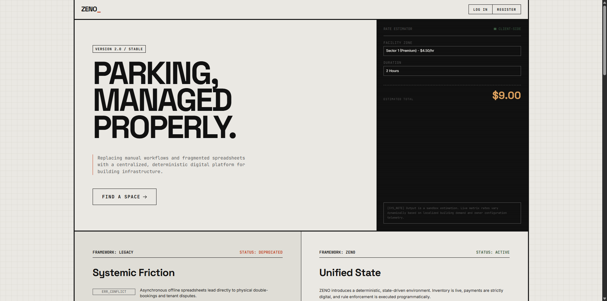
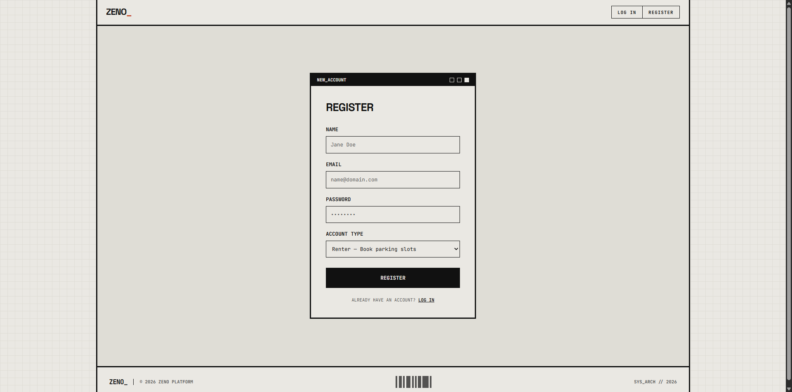
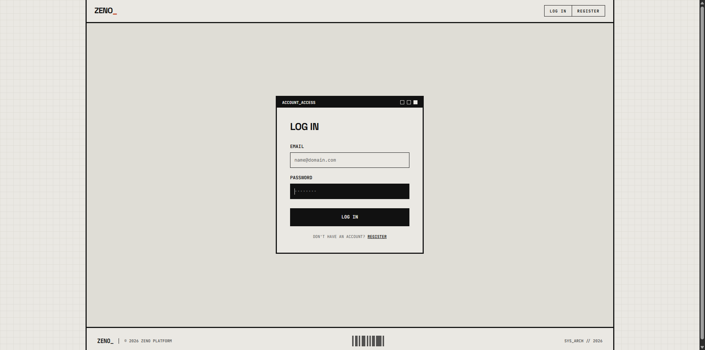
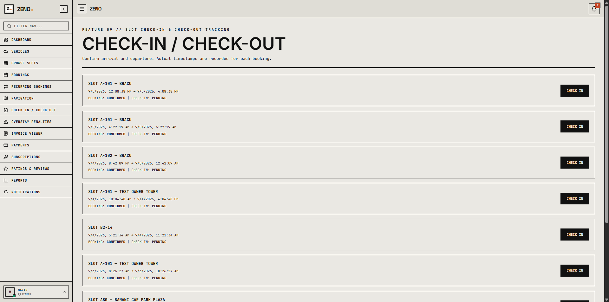
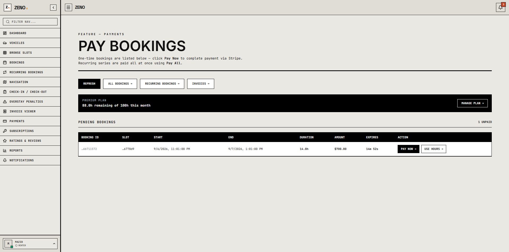
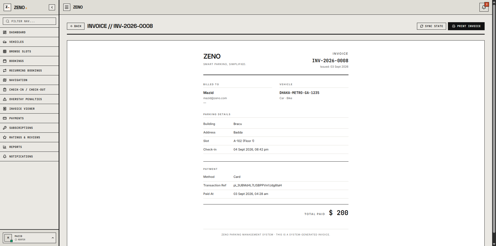
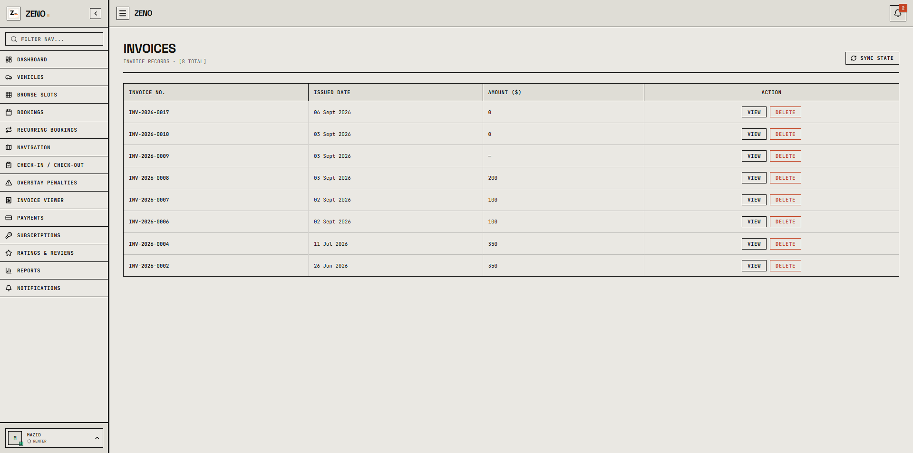
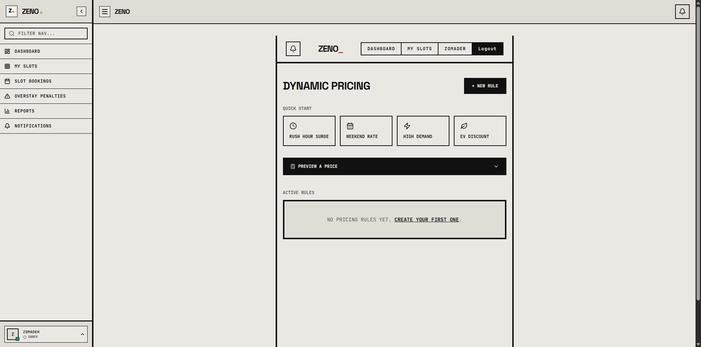
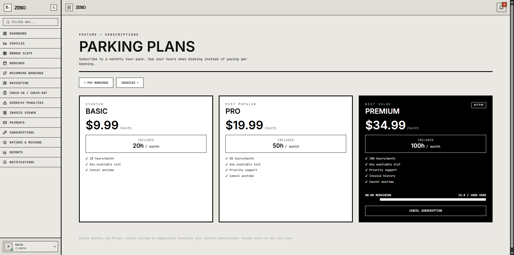
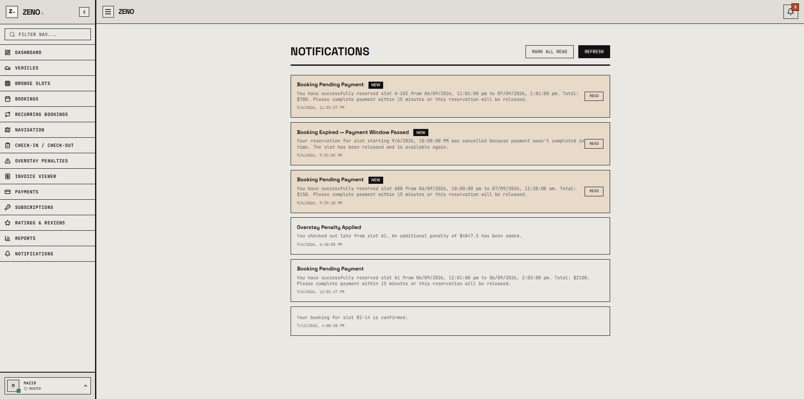

<p align="center">
    <a href="https://notmazidzomader.github.io/ZENO/" target="_blank">
        
    </a>
</p>

<div align="center"> 
    
## Project Description
 
***ZENO*** is a web-based parking area rental and management platform built for residential and commercial buildings. It replaces the manual, error-prone process of tracking parking slots on spreadsheets or paper logs with a centralized system that lets building administrators, slot owners, and renters interact through one application.

</div>

---

> 📌 Project developed as part of **CSE470: Software Engineering** at **BRAC University**, Summer 2026.

---

<p align="center">
  <!-- Stack -->
  
  <!-- MongoDB -->
  
  <!-- Express -->
  
  <!-- React -->
  
  <!-- Node -->
  
  <br>
  <!-- Vite -->
  
  <!-- Tailwind CSS -->
  
  <!-- JWT -->
  
  <!-- Stripe -->
  
  <!-- Leaflet -->
  
  <!-- PDFKit -->
  
</p>

## Getting Started & Setup

Follow these steps to get the project up and running locally.

### Prerequisites

Ensure you have the following installed on your machine:
- [Node.js](https://nodejs.org/) (v18 or higher recommended)
- [npm](https://www.npmjs.com/) or [yarn](https://yarnpkg.com/)
- [MongoDB](https://www.mongodb.com/) (Local instance or a free [MongoDB Atlas](https://www.mongodb.com/atlas) cluster)

---

### 1. Clone the Repository

```bash
git clone https://github.com/mazidzomader/ZENO.git
cd ZENO
```

---

### 2. Backend Setup

1. Navigate to the `backend` directory:
   ```bash
   cd backend
   ```

2. Install backend dependencies:
   ```bash
   npm install
   ```

3. Create a `.env` file in the `backend` directory (you can copy `.env.example`):
   ```bash
   cp .env.example .env
   ```

4. Configure the environment variables inside `.env`:
   ```env
   PORT=5000
   MONGO_URI=your_mongodb_connection_string
   JWT_SECRET=your_jwt_secret_key
   STRIPE_SECRET_KEY=your_stripe_secret_key
   CLIENT_URL=http://localhost:5173

   # Optional: Email notification settings (defaults to Ethereal test inbox if omitted)
   # EMAIL_HOST=smtp.gmail.com
   # EMAIL_PORT=587
   # EMAIL_USER=your-email@gmail.com
   # EMAIL_PASS=your-app-password
   # EMAIL_FROM=noreply@zeno.com
   ```

5. Start the backend development server:
   ```bash
   npm run dev
   ```
   *The server will start on `http://localhost:5000`.*

---

### 3. Frontend Setup

1. Open a new terminal and navigate to the `frontend` directory:
   ```bash
   cd frontend
   ```

2. Install frontend dependencies:
   ```bash
   npm install
   ```

3. Start the Vite development server:
   ```bash
   npm run dev
   ```
   *The client will be running at `http://localhost:5173`.*

---

## Contributors

This project exists thanks to all the people who contribute.
<div align="center"> 
    
| Student ID | Name |
|---|---|
| 24241189 | Abdullah Al Mazid Zomader |
| 23201003 | Masrur Sarar |
| 22299250 | Sraboni Din Awal |
| 22299058 | Arobi Al Amin Twinkle |
<br>
<p align="center">
  <a href="https://github.com/mazidzomader"></a>
  <a href="https://github.com/awalsra"></a>
  <a href="https://github.com/arobi-alamin"></a> 
  <a href="https://github.com/ConquerCommand"></a>
</p>
</div>

## License

Licensed under the MIT License, Copyright © 2026-present.

## Screenshots

<div align="center">
  
  <br><br>
  
  <br><br>
  
  <br><br>
  
  <br><br>
  
  <br><br>
  
  <br><br>
  
  <br><br>
  
  <br><br>
  
  <br><br>
  
  <br><br>
  
  <br><br>
  
  <br><br>
  
  <br><br>
  
  <br><br>
  
  <br><br>
  
  <br><br>
  
  <br><br>
  
  <br><br>
  
  <br><br>
  
  <br><br>
  
  <br><br>
  
  <br><br>
  
  <br><br>
  
  <br><br>
  
  <br><br>
  
  <br><br>
  
  <br><br>
  
  <br><br>
  
  <br><br>
  
  <br><br>
  
  <br><br>
  
</div>